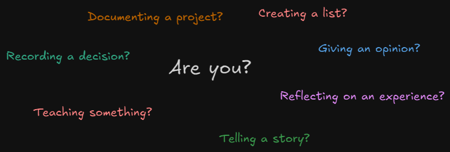

So you want to start writing. You have half-baked ideas rotting in a dark corner of your Obsidian vault. Nothing wrong with it—I’ve been there. In fact, I’m there right now, writing this post. That’s why I’ve put together a guide for your first blog post - it's how I wrote this one!

### Topic

You clearly have something on your mind that you want to get out. That’s your topic. It’s the itch in your brain that can only be scratched by articulating it and putting it into a computer, and hopefully spreading it into others’ brains. Don’t choose your topic carefully; you should choose the first thing that comes into your head, because that’s the idea that’s authentically on your brain—and that’s special. Don’t judge it!

**"Well, I’ve been thinking about writing a series of blogs or articles to get my ideas out of my brain and into the world! Is that a topic?"**

### Reason to Write

Hopefully you’ve found a juicy topic that you’re passionate about. We now have to choose a reason to write. Your topic is what you're writing about, the reason is what you're trying to accomplish. So... why are you writing this article? Are you arguing an opinion? Telling a story? Teaching a lesson? This is important because it will serve as a basis for the structure of your article, and it gives the reader a reason to read! The answer comes down to a few options (presented in picture form because it looks nice):

Do you have your reason yet? Did you look at the picture? You should have one by now—I worked hard on that! Whatever your reason, readers will now also have a reason to read your article. Their reason to read could be to learn something, to be entertained, or to be exposed to an interesting opinion. All of the reasons to read match up to one or more reasons to write!

**"Hmmm. I feel like teaching something today! I’m writing for people who want to learn. That wasn’t so bad. But where do I begin?"**

### Figure Out Structure

Your writing should follow a general structure so the reader can make sense of your ideas. If you just wordslop onto a page, it might feel good getting all of your ideas out, but no one will want to consume a disorganized brain dump. At this point, use your big boy, big girl, or big person beyond-the-binary brain and build an outline for your article! (I tend to use the internet for stuff like that. There’s this thing called AI, too—have you heard of it?) Structure is what will make ideas that make sense in your brain make sense in other people’s brains, too. Figure out the outline that fits your topic, and then you can start to treat it like a fill-in-the-blank.

**"I’m teaching something step by step… Google says I should present the steps clearly explained and the reasons why each step is required. Easy enough structure!"**

### Write!

Now go find your voice! This is the last step between you and being a real writer—and guess what? Your favourite author, blogger, or writer has been in the very shoes you are in now. Fill in your blanks, support your arguments, teach the stuff you know! And treat your first time as an experiment to see what you liked about writing and how you liked to work. And most importantly, finish it. I'll leave you with some of the final bosses you'll face that will try to stop you along the way to the end.

1. Second-guessing a point or an idea. If it makes sense to you, it’s worth writing about.
2. Hyper self-criticism. You’re always going to believe that your work isn’t as good as it should be. Accept that it will suck and write anyway!
3. Over-revisioning. Revising is great practice, but make sure you’re making the work more understandable, entertaining, or enticing. Don’t revise laterally.
4. Self-consciousness. Your writing, especially early on, **should** make you feel a little vulnerable. If you expect people to read your writing, you leave yourself exposed to the potential for criticism of your very thoughts and voice, and that’s scary. “My friends, family, co-workers will think I’m weird! They’ll judge me and talk behind my back!” Now, I can’t advise how to get over these thoughts in a single sentence (maybe an article), but we both know that those thoughts are baloney. Use whatever method works for you to get over the insecurities and embrace your new experimental phase in writing!
